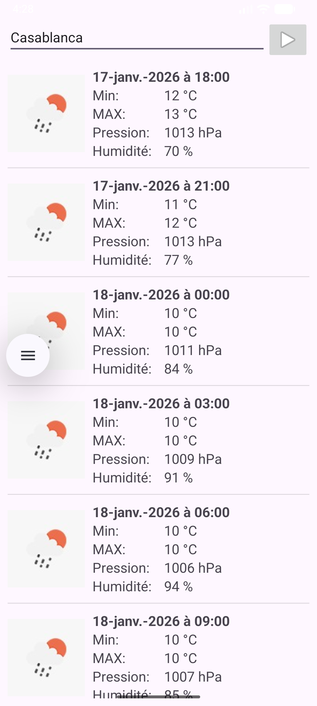

# Application Météo Android Utilisant API

Une application Android native développée en Java qui permet aux utilisateurs de consulter les prévisions météorologiques détaillées pour n'importe quelle ville dans le monde.

## 📋 Table des matières
- [Fonctionnalités](#fonctionnalités)
- [Technologies utilisées](#technologies-utilisées)
- [Architecture du projet](#architecture-du-projet)
- [Installation et exécution](#installation-et-exécution)
- [Structure du code](#structure-du-code)
- [API utilisée](#api-utilisée)
- [Auteur](#auteur)

## Fonctionnalités

- 🔍 **Recherche météo par ville** : Saisissez le nom d'une ville pour obtenir les prévisions météorologiques
- 📊 **Prévisions détaillées** : Affichage des températures minimales et maximales, pression atmosphérique, humidité et dates
- 📅 **Prévisions à 5 jours** : Visualisation des conditions météorologiques sur 5 jours avec intervalles de 3 heures
- 🖼️ **Icônes météo** : Représentation visuelle des conditions météorologiques (ciel dégagé, nuages, pluie, orage)
- 🔄 **Actualisation en temps réel** : Données météo actualisées depuis l'API OpenWeather
- 📱 **Interface utilisateur fluide** : Expérience utilisateur optimisée avec ListView personnalisé

## Technologies utilisées

- **Langage** : Java
- **Framework** : Android SDK
- **HTTP Client** : Volley Library (com.android.volley:volley:1.2.1)
- **Format de données** : JSON
- **IDE** : Android Studio
- **Build System** : Gradle (Kotlin DSL)
## Screenshot De Application

